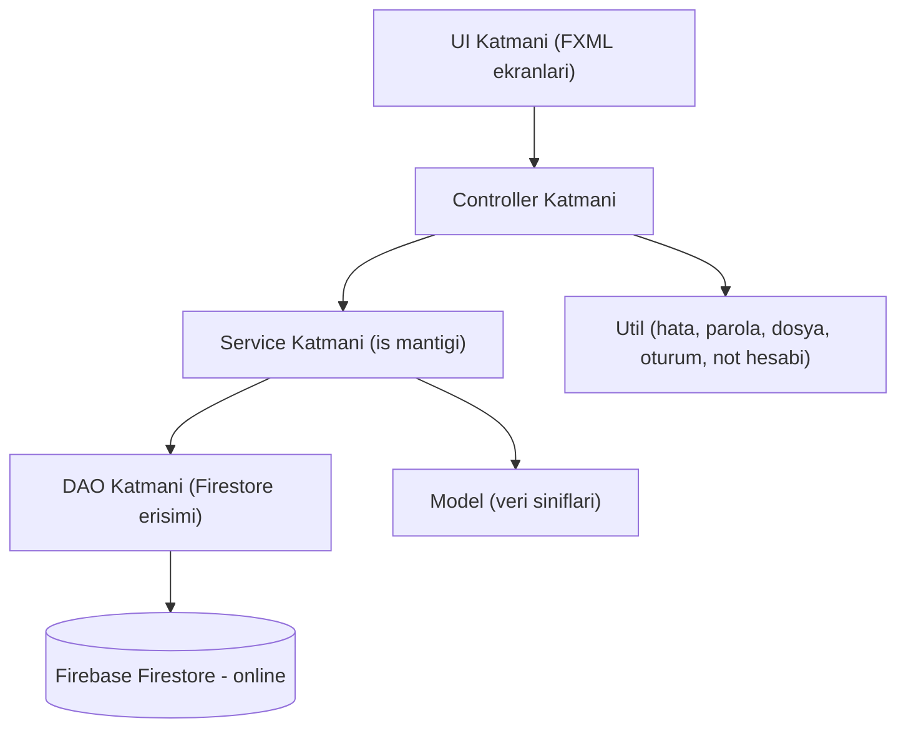
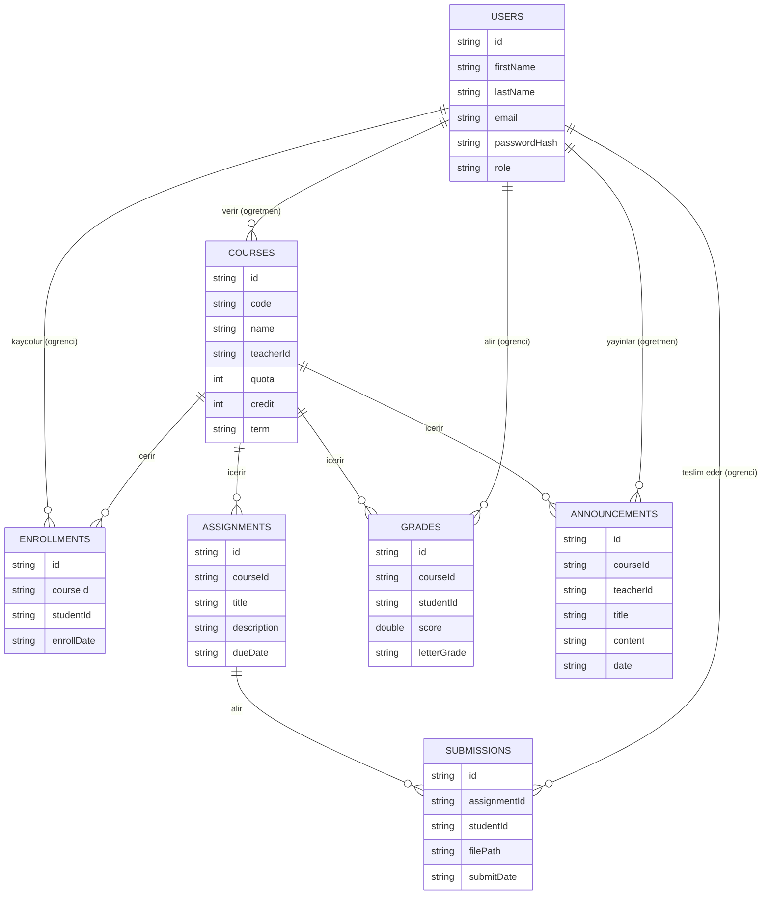
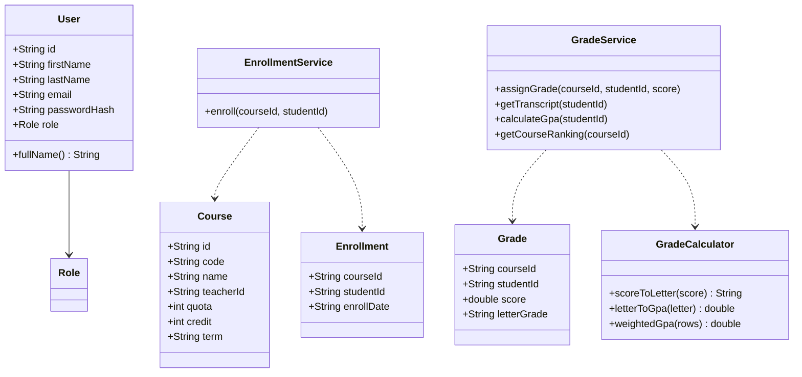
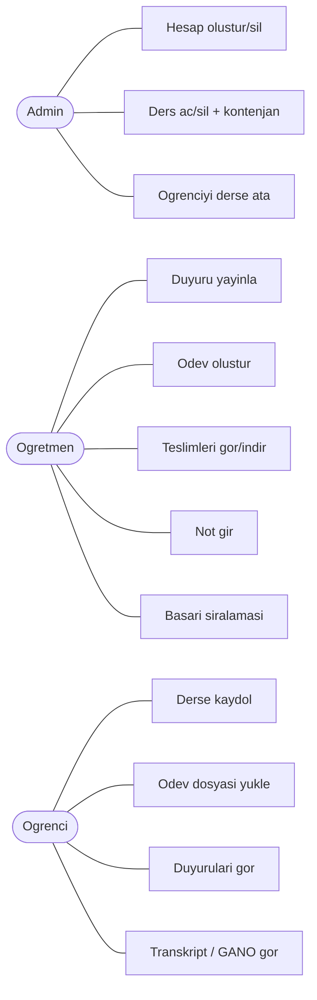

# Proje Dokümantasyonu — Okul Yönetim Sistemi

Bu dosya teknik rapor için temel diyagramları ve açıklamaları içerir.
Diyagramlar **Mermaid** ile yazılmıştır; [mermaid.live](https://mermaid.live) sitesine yapıştırıp
PNG olarak indirip rapora ekleyebilirsin.

---

## 1. Sistem Mimarisi (Katmanlı Mimari)



Her katmanın tek bir sorumluluğu vardır ve yalnızca bir alttaki katmanla konuşur.
Bu sayede kod test edilebilir ve bakımı kolaydır (DAO ayrı olduğu için Service testlerinde Firestore mock'lanabilir).

---

## 2. Veritabanı / Veri Modeli (ER Diyagramı)

Firestore NoSQL bir veritabanıdır; ancak entiteler ve ilişkiler ilişkisel mantıkla,
**tekrarsız** ve **ID ile bağlı** (normalizasyon prensibi) tasarlanmıştır.



**Koleksiyonlar (7):** users, courses, enrollments, assignments, submissions, grades, announcements.

---

## 3. UML Sınıf Diyagramı (sadeleştirilmiş)



---

## 4. Kullanım Senaryosu (Use Case)



---

## 5. Algoritma — GANO (Genel Not Ortalaması) Hesabı

Projenin "Algoritma / Yenilikçi Yaklaşım" kısmı `GradeCalculator` sınıfındadır.

**Adımlar:**
1. Sayısal not (0–100) harf notuna çevrilir: 90+ → AA, 80+ → BA, 70+ → BB, 65+ → CB, 60+ → CC, 55+ → DC, 50+ → DD, altı → FF.
2. Harf notu katsayıya çevrilir: AA=4.0, BA=3.5, BB=3.0, CB=2.5, CC=2.0, DC=1.5, DD=1.0, FF=0.0.
3. Kredi ağırlıklı ortalama:

```
GANO = toplam(katsayi * kredi) / toplam(kredi)
```

**Örnek:** BIL101 (3 kredi, AA=4.0) ve MAT101 (4 kredi, BB=3.0):
`(4.0*3 + 3.0*4) / (3+4) = 24 / 7 = 3.43`

Ayrıca **kontenjan kontrolü** (dolu derse kayıt engelleme) ve **başarı sıralaması**
(ders öğrencilerini nota göre büyükten küçüğe sıralama) algoritmaları da uygulanmıştır.

---

## 6. Güvenlik
- Parolalar düz metin tutulmaz; **BCrypt** ile hash'lenir (`PasswordUtil`).
- **Rol bazlı erişim:** her kullanıcı yalnızca kendi rolünün panelini görür (`Session` + giriş yönlendirmesi).
- Firebase'e bağlantı HTTPS üzerinden şifreli yapılır.
- Firebase servis anahtarı (`serviceAccountKey.json`) repoya konmaz (`.gitignore`).
